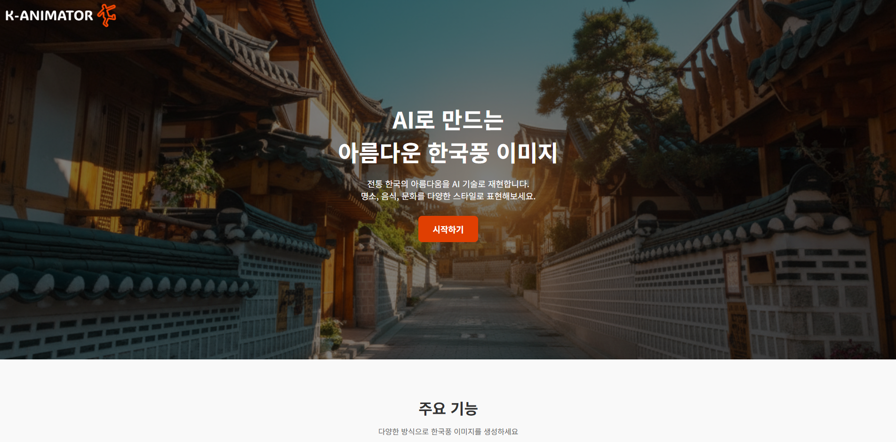

# K-Animator — 한국풍 웹툰 이미지 생성 플랫폼

K-Animator는 한국 웹툰 스타일의 이미지를 자동 생성하는 **AI 기반 이미지 생성 플랫폼**입니다.  
사용자가 입력한 키워드, 장면 설명, 이미지, 음성(STT)을 이용해  
**KoCLIP → GPT-4o → GPT image 1**로 이어지는 파이프라인을 통해  
웹툰풍의 배경/연출 이미지를 자동 생성합니다.

---

## 개발 완료(코드 구현까지 끝난) 기능 — 배포 미완료

아래 기능들은 **코드 구현을 완료했으나**,  
실제 서비스에서 안정적으로 제공하기 위한 **배포·성능 테스트·리소스 구성 시간이 부족하여**  
최종 연동 단계에서 제외한 기능들입니다.

- Stable Diffusion 기반 이미지 생성(로컬 테스트 완료)  
- SD-Inpainting 기반 객체 제거/복원 기능 (로컬 테스트 완료)  
- SAM2 기반 객체 분리 기능 (로컬 테스트 완료)  
- 대형 AI 모델을 Docker 이미지에 포함하지 않고, Azure Files 기반 PVC에 저장하여 필요한 Pod들이 공통으로 마운트해 사용할 수 있는 구조로 설계(PVC 연동 준비 완료)  
- 스타일 생성 모드(LoRA 스타일 적용 코드 일부 구현)  
- 모델 작업용 GPU 노드 연동 코드 작성 (AKS 배포 미완료)  

> 즉, **기능 자체는 대부분 구현을 마쳐놨고**,  
> 프로덕션 환경에 안정적으로 올리기 위한 클라우드/리소스 준비가 부족해  
> 배포만 하지 못한 상태입니다.

---
## 주요 기능

- 한국풍 웹툰 스타일 이미지 자동 생성  
- KoCLIP 기반 유사 이미지 검색  
- GPT-4o 기반 프롬프트 생성  
- GPT image 1 기반 이미지 생성
- Microsoft Speech SDK 기반 음성 입력(STT)  
- Azure 기반 MSA 아키텍처  
- Celery 기반 비동기 처리  
- Logging + Monitoring 구축 (Fluent-bit / Loki /Prometheus / Grafana)

---

## 시스템 아키텍처

---
첫 화면 (Landing Page)

  

로그인 / 회원가입
<table align="center"> <tr> <td align="center"><b>로그인</b></td> <td align="center"><b>회원가입</b></td> </tr> <tr> <td align="center"></td> <td align="center"></td> </tr> </table>
기본 모드 — 이미지 생성

  

이미지 편집 모드

  

내 정보 보기 (프로필)

  

## AI 파이프라인 상세

### 1) KoCLIP 임베딩  
- 사용자 입력 + 이미지 기반 similarity search  
- PostgreSQL(Vector) 기반 벡터 유사도 검색

### 2) GPT-4o 프롬프트 생성  
- 한국어 → 고품질 웹툰 스타일 Prompt 자동 생성  
- 사용자 키워드/장면 설명 기반

### 3) GPT image 1 이미지 생성  
- 1024×1024 PNG 이미지 생성  
- Azure Blob에 저장  
- 자동 PSD 변환(ImageMagick)

---

## ☁ Azure 기반 인프라 구성

- **AKS (Azure Kubernetes Service)**  
- **Azure Blob Storage**  → 생성된 이미지 저장
- **Azure PostgreSQL**  → 회원정보 및 사진 URL 저장
- **Azure Redis Cache** → Refresh 토큰 저장
- **Azure API Management (APIM)** → JWT 검증  
- **Azure Front Door** → 전역 트래픽 라우팅  
- **Azure Key Vault**  →  시크릿값 저장
- **Azure Files** (AI 모델 체크포인트 저장)

---

### **Tech Stack**

| 구분 | 기술 |
|------|------|
| **Frontend** |    |
| **Backend** |    |
| **Database** |   |
| **Storage** |  |
| **AI / ML** |     |
| **Infra / DevOps** |      |
| **Gateway / CDN** |   |
| **CI/CD** |   |
| **Monitoring** |   |
| **Logging** |   |

---

## Tools
| 구분 | 도구 |
|------|------|
| **DB Management** |  |
**Redis Management** |  |
| **API Docs / Test** |  |

---

## CI/CD & GitOps

### GitHub Actions
- 서비스 변경 자동 감지 (paths-filter)  
- 변경된 서비스만 Docker build & GHCR push  
- manifest 자동 업데이트  
- Kustomize <code style="background:#2d2d2d;color:#fff;padding:3px 5px;border-radius:1px;">kustomization.yaml</code> 이미지 태그 자동 패치
### ArgoCD
- GitOps 기반 자동 배포  
- 상태 모니터링 및 자동 Sync
- Kustomize 기반 환경별(Dev/Prod) Overlay 적용

---

## 모니터링 & 로깅

- **Prometheus** — 메트릭 수집  
- **Grafana** — 대시보드  
- **Fluent-bit** — 노드 로그 수집  
- **Loki** — 로그 저장/조회  

